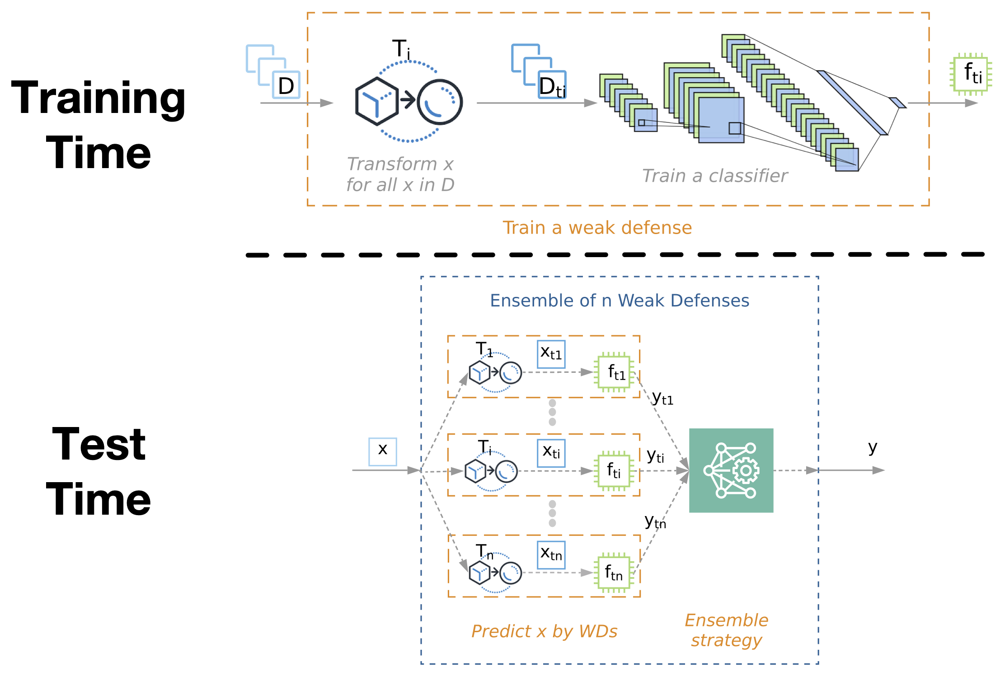

# Athena: A Framework for Defending Machine Learning Systems Against Adversarial Attacks


## Table of Contents
1. [**Dependencies**](#1-dependencies)
2. [**Attacks and Transformations**](#2-attacks-and-transformations)
3. [**Project Structure**](#3-project-structure)
4. [**Getting Started**](#4-getting-started)
5. [**How to Contribute**](#5-how-to-contribute)
6. [**Citation and References**](#6-citation-and-references)

## Introduction
This repository hosts the Athena framework source code. The main finding of this work is that many weak defenses, neural networks trained on disjointly transformed datasets, can be combined into an ensemble network to effectively and efficiently defend against deep neural network adversarial attacks. This codebase provides a framework for training weak defenses with transformations, building ensemble of weak defenses, provides implemented attack methods to test the effectiveness of Athena, and provides all other subsequent source code and tooling to replicate the results of the experiments in this [publication](https://arxiv.org/pdf/2001.00308.pdf).

## Framework Architecture




## Manual Installation

Clone the repository:
```
git clone git@github.com:softsys4ai/athena.git
```
Navigate to the directory where the repository was downloaded and run the following commend to install software dependencies:
```
pip install requirements.txt
```

### Hardware Requirements
```
Processor (recommended): 2 x 3.0 GHz CPU cores
Memory: >=16 GB RAM
Disk: >=30 GB available on disk partition
Storage: >=20 MBps
```

## Getting Started

### How do I install the project?
1. Navigate to the ["Manual Installation"](#manual-installation) instructions sub-section to install all software requirements.
2. Use the following tutorials to get up and running


### How do I configure/change project parameters?

```
    Script: athena/utils/config.py
    Description:
    This class contains a plethora of variables and class definitions for use across the project.
    
    Command Line Arguments
    ----------------------
    none.
    
    Methods
    -------
    class DATA(object)
        Class to contain information about selected datasets.

    class TRANSFORMATION(object)
        Contains a dictionary of supported transformations and strings used to reference them.

    class ATTACK(object)
        Contains a dictionary of supported attacks and strings used to reference them and attack specific parameter values; 

    class MODEL(object)
        Contains a model's architecture, training/testing dataset, and training hyperparameters.
    
    class MODE(object)
        Contains a "DEBUG" boolean value (default is false) to set the project to toggle the project in and out of debug mode.

    class PATH(object)
        Contains variables containing the absolute path of the project as well as the relative paths of important project resources, logging, and save locations.
```


### How do I load a dataset?
#### Available datasets
**Dataset Name** | **Description**
--- | ---
MNIST | Grayscale 28x28 pixel handwritten digit dataset (10 classes) containing 60,000 training and 10,000 validation examples.
Fashion-MNIST | Grayscale 28x28 pixel clothing dataset (10 classes) containing 60,000 training and 10,000 validation examples. 
CIFAR-10 | RGB 32x32 pixel dataset (10 classes) containing 50,000 training and 10,000 validation examples.
CIFAR-100 | RGB 32x32 pixel dataset (100 classes) containing 50,000 training and 10,000 validation examples.

```
    Script: athena/data.py
    Description:
    Generally, the use of this dataset loading class should be left for usage in our scripts. However, if you desire to load a dataset for your own experimentation, you may use this class to do so.
    
    Command Line Arguments
    ----------------------
    none.
    
    Methods
    -------
    load_data(dataset)
        Returns four variables: (X_train, Y_train), (X_test, Y_test). "X_train" and "Y_train" contain neural network inputs and outputs, respectively, for training a neural network. "X_test" and "Y_test" contain neural network inputs and outputs, respectively, for validating the accuracy of the neural network.
    normalize(X)
        Returns one variable: X. Normalizes the four dimensional (num. data samples, width, height, depth) input dataset X in order to use it for training. Normalization scales down dataset values, while preserving relative differences, for use as input to a neural network.
```


### How do I use attack methods and craft adversarial examples?

```
    Script: athena/scripts/craft_adversarial_examples.py
    Description:
    To craft adversarial examples provide this script with the name of a dataset and the name of the attack method you would like to use to generate examples.
    
    Command Line Arguments
    ----------------------
    none.
    
    Methods
    -------
    craft(dataset, method)
        Saves adversarial examples to the ADVERSARIAL_FILE path specified in the config.py file.
```

### How do I create and train a vanilla model on a vanilla dataset?

```
    Script: athena/models.py
    Description:
    To create and train a weak defense you may use this script. To properly train a weak defense, create a model and then train the model on your dataset with an applied transformation.
    
    Command Line Arguments
    ----------------------
    none.
    
    Methods
    -------
    create_model(dataset, input_shape, nb_classes)
        Returns a convolutional neural network model built with a representational capacity best suited for the specific dataset that you are using.

    train_model(model, dataset, model_name, need_augment=False, **kwargs)
        Returns a trained version of the model provided. Training hyperparameters can be found both in this method and the config.py file if you would like to change any of them for your use case.

    train(model, X, Y, model_name, need_augment=False, **kwargs)
        Returns a trained model. This method is used by the train_model() method but can be called as a standalone method if you choose to train a model on a custom dataset.

    evaluate_model(model, X, Y)
        Returns the following variables: acc, ave_conf_correct, ave_conf_miss. This method consumes a model and the test dataset in order to evaluate the accuracy of the model. Accuracy is defined as the percentage of correct classifications by the provided model.

    save_model(model, model_name, director=PATH.MODEL)
        Serializes and saves the model to disk at the path created by concatenating the paths provided in the director and model_name parameters. 

    load_model(model_name, director=PATH.MODEL)
        Returns a tensorflow model. Loads and compiles a saved model from disk at the path created by concatenating the paths provided in the director and model_name parameters.
```

### How do I create and train weak defenses?

```
    Script: athena/train.py
    Description:
    This script trains a weak defense for each type of transformation and saves each model to the specified models directory to be used to build an ensemble.
    
    Command Line Arguments
    ----------------------
    samplesDir : str
        File path of input images to train the weak defense
    rootDir : str
        File path of the directory of the project
    modelsDir : str
        File path of directory to store trained weak defenses
    numOfSamples : int
        Upper bound of the number of the dataset input indices to be used for training/validation.
    kFold : int
        Number of folds, used to determine the validation training set size.
    datasetName : str
        Name of the dataset to be used for training (mnist, fmnist, cifar10, cifar100)
    numOfClasses
        Number of output classes of the provided dataset

    Methods
    -------
    usage()
        Call this method to print instructions for how to use this script to your standard output stream.
```

### How do I construct and evaluate an ensemble of weak defenses?

    Now that you have trained weak defenses, you are likely wondering, how do I build an ensemble of these weak defenses to defend against adversarial attacks? In our project, we construct and use ensembles by loading all of the trained weak defenses from a specified models directory, perform inference on a given subset of a dataset with each of the weak defenses, and then save all of the models' output probabilities and logits to disk at a specified prediction result directory for further analysis.

```
    Script: athena/test_ensemble_model_on_all_types_of_AEs.py
    Description:
    This script evaluates the ensemble model, the model composed of all of the models trained with train.py, and saves all of the results to a specified test result folder.
    
    Command Line Arguments
    ----------------------
    samplesDir : str
        Path to directory containing the correct output labels for the network.
    experimentRootDir : str
        Path to directory of the root of the project.
    modelsDir : str
        Path to directory where all of the trained models are saved.
    numOfSamples : int
        Upper bound of the number of samples to use for evaluation of the ensemble.
    testResultFoldName : str
        Path to directory where test results are to be stored.
    datasetName : str
        Name of the dataset to be used for training (mnist, fmnist, cifar10, cifar100)
    numOfClasses : int
        Number of output classes for the provided dataset.
    
    Methods
    -------
    none.
```


### What other scripts should I be aware of?

```
    Script: athena/attacks/attacker.py
    Description:
    This script calls orchestrates and calls all other attack scripts in its directory to produce adversarial examples with a given attack type on a given, trained model.
    
    Command Line Arguments
    ----------------------
    none.

    Methods
    -------
    get_adversarial_examples(model_name, attack_method, X, Y, **kwargs)
        Returns the following variables: X_adv and Y. "X_adv" is a vector containing all of the generated adversarial examples and Y is a vector of the same length containing the correct class labels for each created adversarial example.
```
```
    Script: athena/utils/file.py
    Description:
    This is a helper script that provides methods to read and write ensemble model evaluations from and to disk. The methods contained within this script may be called on their own. Currently, this script's functions are leveraged by the "test_ensemble_model_on_all_types_of_AEs.py" script for recording produced ensemble evaluation results.
    
    Command Line Arguments
    ----------------------
    none.

    Methods
    -------
    dict2csv(dictionary, file_name, list_as_value=False)
        Saves a given dictionary to a csv file located at the path specified by the "file_name" parameter. If only a file name is specified, the csv will be saved in the athena/utils directory.
    csv2dict(file_name, orient=ORIENT.COL, dtype='float')
        Reads a csv at the path specified by the "file_name" parameter and returns the dictionary stored in the CSV file.
    save_adv_examples(data, **kwargs)
        Saves adversarial examples provided in the "data" parameter to the path specified by the "ADVERSARIAL_FILE" variable in the "config.py" script.
```

## How to Contribute


We welcome new features, extension, or enhancements of this framework. Bug fixes can be initiated through GitHub pull requests. 

We are, in particular, looking for new collaborations, taking this framework further and applying Athena to new application domains such as medical imaging, voice, and text. Please drop us an email if you are interested.


## Citing this work

If you use Athena for academic or industrial research, please feel free to cite the following [paper](https://arxiv.org/pdf/2001.00308.pdf):

```
@article{athena2020,
  title={Ensembles of Many Weak Defenses can be Strong: Defending Deep Neural Networks Against adversarial Attacks},
  author={Meng, Ying and Su, Jianhai and O’Kane, Jason and Jamshidi, Pooyan},
  journal={arXiv preprint arXiv:2001.00308},
  year={2020}
}
```

## Contacts

* [Pooyan Jamshidi](https://pooyanjamshidi.github.io/)
* [Ying Meng](https://github.com/MENG2010)

## Contributors

* [Ying Meng](https://github.com/MENG2010)
* [Jianhai Su](https://github.com/oceank)
* [Blake Edwards](https://github.com/blakeedwards823)
* [Stephen Baione](https://github.com/StephenBaione)
* [Pooyan Jamshidi](https://github.com/pooyanjamshidi)


## Acknowledgements
This project has been partially supported by:
* Google via GCP cloud research credits
* NASA (EPSCoR 521340-SC001) 